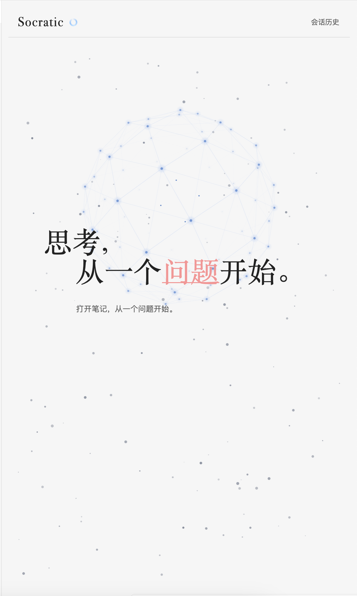
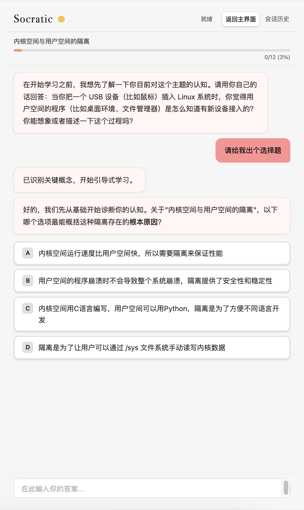
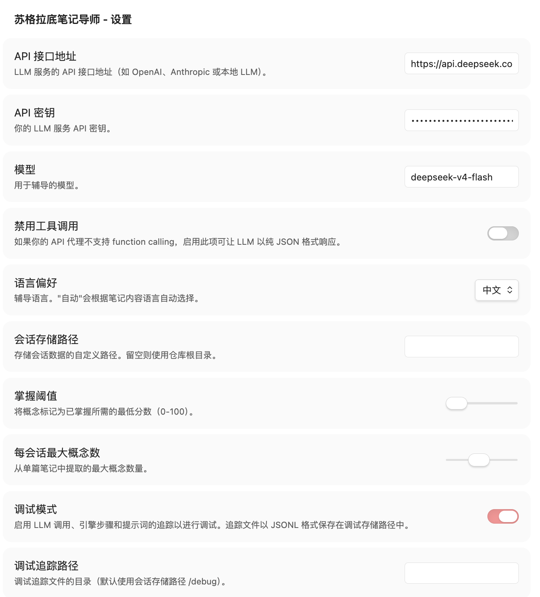
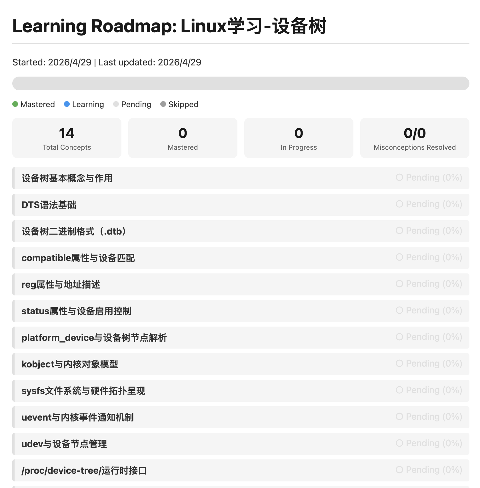

# Socratic Note Tutor

> 基于 Obsidian 的苏格拉底式 AI 导师插件，运用大语言模型（LLM）与 Bloom 2-Sigma 教学法，通过启发式提问引导你进行深度学习。

---

## 目录

- [项目简介](#项目简介)
- [核心功能](#核心功能)
- [项目结构](#项目结构)
- [安装指南](#安装指南)
- [使用方法](#使用方法)
- [配置说明](#配置说明)
- [技术架构](#技术架构)
- [开发构建](#开发构建)
- [许可证](#许可证)

---

## 项目简介

**Socratic Note Tutor** 是一款 Obsidian 插件，它将你的笔记内容转化为个性化的苏格拉底式辅导课程。插件不会直接给出答案，而是通过一系列精心设计的提问，引导你自己发现知识盲点、梳理概念脉络，并最终达到真正的掌握（Mastery）。

插件深度融合了以下教育理念：

- **苏格拉底提问法**：只问不答，激发主动思考
- **Bloom 2-Sigma 效应**：一对一针对性辅导，显著提升学习效果
- **掌握学习（Mastery Learning）**：每个概念必须达到设定阈值才算真正掌握
- **间隔重复（Spaced Repetition）**：自动安排复习，对抗遗忘曲线
<table border="0">
  <tr>
    <td></td>
    <td></td>
  </tr>
</table>
你还可以让苏格拉底给你出选择，右图是设置界面。
<table border="0">
  <tr>
    <td></td>
    <td></td>
  </tr>
</table>

---

## 核心功能

### 1. 智能概念提取与知识图谱
打开任意一篇笔记并点击「开始辅导」，插件会自动分析笔记内容，提取出 5-15 个核心概念，并按依赖关系排序，生成可视化的学习路线图（Roadmap）。目录在你的.socratic-sessions下笔记文件夹下。

### 2. 苏格拉底式对话教学
针对每个概念，AI 导师会通过多轮对话进行引导：
- **诊断阶段**：先了解你对该主题的已有认知
- **教学阶段**：通过开放式问题或选择题逐步引导
- **掌握检测**：每轮对话后自动评估掌握程度（4 维度评估）
- **练习任务**：掌握后布置应用型练习，巩固知识

### 3. 四维度掌握评估
系统从以下四个维度评估你对概念的掌握程度：
- **正确性（Correctness）**：回答是否准确
- **解释深度（Explanation Depth）**：能否用自己的话清晰解释
- **新颖应用（Novel Application）**：能否迁移到新场景
- **概念辨析（Concept Discrimination）**：能否区分相似概念

默认掌握阈值为 **80%**，可在设置中调整。

### 4. 间隔重复复习
对已掌握的概念，系统会根据艾宾浩斯遗忘曲线自动安排复习：
- 初次掌握后 1 天复习
- 每次答对，复习间隔翻倍
- 答错则缩短间隔，针对性强化

### 5. 会话历史与断点续学
所有辅导会话自动保存到本地。你可以：
- 随时查看某篇笔记的历史会话
- 切换笔记时自动检测未完成会话，选择继续或重新开始
- 会话完成后自动生成学习总结报告

### 6. 学习者画像（Learner Profile）
插件会长期追踪你的学习轨迹，构建个性化画像：
- 擅长与薄弱的概念领域
- 常见的认知误区模式
- 自我评估校准历史
- 长期记忆提取

### 7. 多语言支持
内置中英文双语界面，支持：
- 手动切换语言
- 根据笔记内容自动检测语言
- 整个辅导流程（包括 AI 提问）均使用对应语言

### 8. 选文提问
在笔记中选中任意一段文字，右键选择「询问选中的文本」，即可针对该片段进行专项辅导，无需完整阅读整篇笔记。

### 9. 智能测试生成
基于你的历史辅导会话，AI 可以自动生成针对性的测试习题，帮助你检验学习成果：
- **多源选题**：从任意笔记、任意会话、甚至任意单条消息中自由组合出题素材
- **树形选择器**：按「笔记 → 会话 → 消息」三级结构浏览历史记录，展开后勾选所需内容
- **全选快捷键**：展开某一级后点击「全选」，可一键选中该层级下的所有内容
- **智能出题**：AI 根据选中的对话内容生成选择题、填空题和开放题，附带答案解析

### 10. 调试追踪
开启调试模式后，插件会详细记录每一次 LLM 调用、引擎阶段切换和提示词内容，以 JSONL 格式保存到指定目录，便于排查问题或优化提示词。

---

## 项目结构

```
.
├── src/
│   ├── main.ts                 # 插件入口，生命周期管理
│   ├── types.ts                # 核心类型定义（概念、会话、设置等）
│   ├── settings.ts             # 插件设置面板
│   ├── templates.ts            # 学习路线图 & 总结报告 HTML 模板
│   ├── core/
│   │   └── TutoringFlow.ts     # 辅导流程编排（会话生命周期）
│   ├── engine/
│   │   ├── SocraticEngine.ts   # 苏格拉底引擎（对话策略、阶段管理）
│   │   ├── ResponseParser.ts   # LLM 响应解析器
│   │   └── ResponseHealer.ts   # 响应修复（空内容、格式错误等容错）
│   ├── llm/
│   │   ├── LLMService.ts       # LLM API 调用服务（OpenAI 兼容）
│   │   ├── PromptBuilder.ts    # 提示词构建器
│   │   └── tools.ts            # Function Calling 工具定义
│   ├── session/
│   │   ├── SessionManager.ts   # 会话持久化管理
│   │   └── ...                 # 记忆提取、学习者画像等
│   ├── ui/
│   │   ├── ReactSocraticView.ts # Obsidian View 封装
│   │   └── react/              # React UI 组件
│   │       ├── SocraticApp.tsx
│   │       ├── SocraticContext.tsx
│   │       └── components/     # 消息气泡、欢迎屏、历史记录等
│   ├── i18n/
│   │   └── translations.ts     # 中英文翻译表
│   ├── utils/                  # 通用工具函数
│   ├── debug/                  # 调试追踪器
│   └── memory/                 # 记忆系统
├── manifest.json               # Obsidian 插件清单
├── styles.css                  # 插件样式
├── esbuild.config.mjs          # 构建配置
├── package.json
├── tsconfig.json
└── README.md
```

---

## 安装指南

### 方法一：通过 GitHub Release 安装（推荐）

1. 前往本项目的 [GitHub Releases](https://github.com/bonerush/Socratic/releases) 页面
2. 在最新版本的发布页面底部「Assets」栏目，下载以下三个文件：
   - `main.js`
   - `manifest.json`
   - `styles.css`
3. 在你的 Obsidian 仓库中创建文件夹：`.obsidian/plugins/socratic-note-tutor/`
4. 将下载的三个文件复制到该文件夹中
5. 重启 Obsidian，进入「设置 → 社区插件」，关闭「安全模式」，然后启用 **Socratic Note Tutor**

### 方法二：通过 BRAT 安装

1. 安装 [BRAT](https://github.com/TfTHacker/obsidian42-brat) 插件
2. 打开 BRAT 设置，点击「Add Beta plugin」
3. 输入仓库地址：`bonerush/Socratic`
4. 点击「Add Plugin」，BRAT 会自动下载并安装

### 方法三：从源码构建

```bash
# 克隆仓库
git clone https://github.com/bonerush/Socratic.git
cd Socratic

# 安装依赖
npm install

# 开发模式（监听文件变化并自动编译）
npm run dev

# 生产构建
npm run build
```

构建完成后，将生成的 `main.js`、`manifest.json`、`styles.css` 复制到你的 Obsidian 插件目录即可。

---

## 使用方法

### 快速开始

1. **配置 API**：首次使用前，进入「设置 → Socratic Note Tutor Settings」，填写你的 LLM API 地址和密钥
   - 支持 DeepSeek、OpenAI、Anthropic、以及任何兼容 OpenAI API 格式的服务商
   - 默认模型为 `deepseek-v4-flash`，可根据需要更换

2. **打开辅导面板**：
   - 点击左侧边栏的 **大脑图标**（🧠）
   - 或使用命令面板（Cmd/Ctrl + P）搜索「Open Socratic Tutor」

3. **开始辅导**：
   - 打开任意一篇笔记
   - 点击「开始辅导」按钮
   - AI 会先进行诊断提问，随后提取概念并展开引导式学习

4. **回答问题**：
   - 在输入框中输入你的思考
   - 若遇到选择题，点击选项即可
   - 每轮结束后系统会评估你的掌握程度
   - 发送后如果改变了想法，在 AI 回复期间按 **Ctrl+C** 即可撤回该条消息

### 常用操作

| 操作 | 方式 |
|------|------|
| 开始辅导当前笔记 | 点击「开始辅导」或使用命令面板 |
| 针对选中文字提问 | 选中文本 → 右键「询问选中的文本」 |
| 查看学习路线图 | 点击「查看学习路线」（会话中生成） |
| 查看会话历史 | 点击右上角的「会话历史」 |
| 生成测试习题 | 点击「生成测试习题」选择历史对话生成测验 |
| 新建会话 | 点击「新建会话」以清空当前进度 |
| 返回主界面 | 点击「返回主界面」结束当前会话 |
| 撤回消息 | AI 思考中按 **Ctrl+C** 取消并撤回最后一条用户消息 |

### 生成测试习题

1. **打开生成器**：在主界面点击「生成测试习题」按钮
2. **选择素材**：在弹出的树形面板中浏览历史记录
   - 第一级为**笔记**：按笔记名称归类所有历史会话
   - 第二级为**会话**：显示每次辅导的时间戳
   - 第三级为**消息**：展示该会话中的具体对话内容
3. **勾选内容**：
   - 点击节点前的展开/收起按钮浏览下级内容
   - 勾选复选框选择需要作为出题素材的节点
   - 展开某一级后点击「全选」，可一键选中该层级下所有内容
4. **开始生成**：点击「生成测试习题」，AI 会基于选中的对话内容自动出题
5. **查看结果**：生成完成后即可查看习题列表，每道题均附带参考答案与解析
6. **导出为 Markdown**：点击「导出为 Markdown」按钮，可将试题一键保存为 `.md` 文件到 vault 根目录

### 笔记切换自动检测

当你在学习过程中切换到另一篇已有未完成会话的笔记时，插件会自动弹窗询问：
- **继续**：恢复之前的进度
- **重新开始**：清空历史，从头开始
- **取消**：保持当前状态

---

## 配置说明

进入「设置 → Socratic Note Tutor Settings」可进行以下配置：

| 配置项 | 说明 | 默认值 |
|--------|------|--------|
| API 接口地址 | LLM 服务的 API 端点 | `https://api.deepseek.com/chat/completions` |
| API 密钥 | 你的 API Key | 空 |
| 模型 | 使用的模型名称 | `deepseek-v4-flash` |
| 禁用工具调用 | 若 API 代理不支持 function calling，启用此项 | 关闭 |
| 语言偏好 | 界面与辅导语言（自动/英文/中文） | 自动 |
| 会话存储路径 | 会话数据的本地存储路径 | 仓库根目录下的 `.socratic-sessions` |
| 掌握阈值 | 标记为已掌握所需的最低分数（50-100） | 80 |
| 每会话最大概念数 | 从单篇笔记提取的最大概念数（3-30） | 15 |
| 调试模式 | 启用 LLM 调用与引擎步骤的追踪 | 关闭 |
| 调试追踪路径 | 追踪文件存储目录 | `sessionStoragePath/debug` |

---

## 技术架构

### 数据流

```
Obsidian Note
     │
     ▼
┌─────────────────┐
│  TutoringFlow   │  ← 会话生命周期管理（开始/恢复/结束）
└────────┬────────┘
         │
         ▼
┌─────────────────┐
│ SocraticEngine  │  ← 对话策略引擎（阶段切换、提示词组装）
└────────┬────────┘
         │
         ▼
┌─────────────────┐     ┌─────────────┐
│  LLMService     │────▶│   LLM API   │
│ (OpenAI 兼容)   │◄────│             │
└─────────────────┘     └─────────────┘
         │
         ▼
┌─────────────────┐
│ SessionManager  │  ← 本地持久化（会话、路线图、学习者画像）
└─────────────────┘
```

### 辅导阶段状态机

```
[诊断] ──▶ [概念提取] ──▶ [教学] ──▶ [掌握检测] ──▶ [练习]
   ▲          │              │           │
   └──────────┴──────────────┴───────────┘ (未完成则循环)
```

### 核心设计原则

- **不可变性（Immutability）**：所有状态更新返回新对象，避免副作用
- **小文件高内聚**：模块按功能域拆分，单个文件不超过 800 行
- **显式错误处理**：每层都有 try-catch，不向用户隐藏异常
- **LLM 容错**：空内容、格式错误、工具调用失败均有降级策略

---

## 开发构建

```bash
# 安装依赖
npm install

# 开发模式（监听 + 热编译）
npm run dev

# 生产构建（类型检查 + 压缩）
npm run build

# 代码检查
npm run lint

# 版本升级（自动更新 manifest.json 和 versions.json）
npm run version
```

### 技术栈

- **TypeScript** + **React 19**（UI 层）
- **esbuild**（打包，支持 JSX）
- **Obsidian API**（插件生命周期、文件系统、编辑器交互）
- **Vitest**（单元测试）

---

## 许可证

本项目采用MIT许可证，可自由使用、修改和分发。

## 致谢
这里需要感谢所有支持我的人，尤其感谢给我带来灵感的项目，如果可以的话也请给他们star!

🔗 https://github.com/sanyuan0704/sanyuan-skills

🔗 https://github.com/claude-code-best/claude-code.git

需要特别说明的是，这次项目使用的工具是ccb，也就是第二个项目。

---

> **提示**：苏格拉底式学习的核心在于「主动思考」。插件设计的初衷不是替代你的学习过程，而是像一位耐心的导师，通过提问帮助你发现自己尚未意识到的理解盲区。请享受这段探索之旅！

---

# Socratic Note Tutor (English)

> An Obsidian plugin that acts as a Socratic AI tutor, leveraging Large Language Models (LLM) and Bloom's 2-Sigma teaching method to guide you through deep learning via heuristic questioning.

---

## Table of Contents

- [Introduction](#introduction)
- [Core Features](#core-features)
- [Project Structure](#project-structure)
- [Installation](#installation)
- [Usage](#usage)
- [Configuration](#configuration)
- [Architecture](#architecture)
- [Development](#development)
- [License](#license)

---

## Introduction

**Socratic Note Tutor** is an Obsidian plugin that turns your notes into personalized Socratic tutoring sessions. Instead of giving answers directly, the plugin asks carefully designed questions to help you discover knowledge gaps, clarify concept relationships, and ultimately achieve true **Mastery**.

The plugin deeply integrates the following educational principles:

- **Socratic Questioning**: Ask, don't tell — stimulate active thinking
- **Bloom's 2-Sigma Effect**: One-on-one targeted tutoring that significantly improves learning outcomes
- **Mastery Learning**: Each concept must reach a set threshold to be considered mastered
- **Spaced Repetition**: Automatic review scheduling to combat the forgetting curve

<table border="0">
  <tr>
    <td></td>
    <td></td>
  </tr>
</table>

You can also let Socrates give you choices. The right images show the settings panel.
<table border="0">
  <tr>
    <td></td>
    <td></td>
  </tr>
</table>

---

## Core Features

### 1. Intelligent Concept Extraction & Knowledge Graph
Open any note and click "Start Tutoring". The plugin automatically analyzes the note content, extracts 5-15 core concepts, sorts them by dependency, and generates a visual learning roadmap. Roadmaps are stored under the `.socratic-sessions` folder in your vault.


### 2. Socratic Dialogue Teaching
For each concept, the AI tutor guides you through multi-round conversations:
- **Diagnostic Phase**: First understands your existing knowledge of the topic
- **Teaching Phase**: Gradually guides through open-ended questions or multiple-choice questions
- **Mastery Detection**: Automatically evaluates mastery after each round (4-dimension assessment)
- **Practice Tasks**: Assigns application-oriented exercises after mastery is achieved

### 3. Four-Dimension Mastery Assessment
The system evaluates your mastery of a concept from the following four dimensions:
- **Correctness**: Whether the answer is accurate
- **Explanation Depth**: Whether you can clearly explain in your own words
- **Novel Application**: Whether you can transfer knowledge to new scenarios
- **Concept Discrimination**: Whether you can distinguish between similar concepts

The default mastery threshold is **80%**, which can be adjusted in settings.

### 4. Spaced Repetition Review
For mastered concepts, the system automatically schedules reviews based on the Ebbinghaus forgetting curve:
- First review 1 day after initial mastery
- Each correct answer doubles the review interval
- Wrong answers shorten the interval for targeted reinforcement

### 5. Session History & Resume Learning
All tutoring sessions are automatically saved locally. You can:
- View historical sessions for any note at any time
- When switching notes, the plugin automatically detects unfinished sessions and asks whether to continue or restart
- After session completion, a learning summary report is automatically generated

### 6. Learner Profile
The plugin tracks your learning trajectory over time to build a personalized profile:
- Strong and weak concept domains
- Common cognitive misconception patterns
- Self-assessment calibration history
- Long-term memory retrieval

### 7. Multi-language Support
Built-in bilingual interface (Chinese and English), supporting:
- Manual language switching
- Automatic language detection based on note content
- The entire tutoring process (including AI questions) uses the corresponding language

### 8. Selected Text Questioning
Select any text in a note, right-click and choose "Ask Selected Text" to get targeted tutoring on that specific excerpt without reading the entire note.

### 9. Intelligent Quiz Generation
Based on your historical tutoring sessions, the AI can automatically generate targeted quiz questions to help you verify learning outcomes:
- **Multi-source Selection**: Freely combine materials from any note, any session, or even any single message
- **Tree Selector**: Browse history by "Note → Session → Message" three-level structure
- **Select All Shortcut**: After expanding a level, click "Select All" to select all content under that level with one click
- **Smart Question Generation**: AI generates multiple-choice, fill-in-the-blank, and open-ended questions based on selected dialogue content, with answer explanations

### 10. Debug Tracing
After enabling debug mode, the plugin will record every LLM call, engine phase switch, and prompt content in JSONL format to a specified directory, facilitating troubleshooting or prompt optimization.

---

## Project Structure

```
.
├── src/
│   ├── main.ts                 # Plugin entry, lifecycle management
│   ├── types.ts                # Core type definitions (concepts, sessions, settings, etc.)
│   ├── settings.ts             # Plugin settings panel
│   ├── templates.ts            # Learning roadmap & summary report HTML templates
│   ├── core/
│   │   └── TutoringFlow.ts     # Tutoring flow orchestration (session lifecycle)
│   ├── engine/
│   │   ├── SocraticEngine.ts   # Socratic engine (dialogue strategy, phase management)
│   │   ├── ResponseParser.ts   # LLM response parser
│   │   └── ResponseHealer.ts   # Response healing (empty content, format error fault tolerance)
│   ├── llm/
│   │   ├── LLMService.ts       # LLM API call service (OpenAI compatible)
│   │   ├── PromptBuilder.ts    # Prompt builder
│   │   └── tools.ts            # Function Calling tool definitions
│   ├── session/
│   │   ├── SessionManager.ts   # Session persistence management
│   │   └── ...                 # Memory retrieval, learner profile, etc.
│   ├── ui/
│   │   ├── ReactSocraticView.ts # Obsidian View wrapper
│   │   └── react/              # React UI components
│   │       ├── SocraticApp.tsx
│   │       ├── SocraticContext.tsx
│   │       └── components/     # Message bubbles, welcome screen, history, etc.
│   ├── i18n/
│   │   └── translations.ts     # Chinese-English translation table
│   ├── utils/                  # General utility functions
│   ├── debug/                  # Debug tracer
│   └── memory/                 # Memory system
├── manifest.json               # Obsidian plugin manifest
├── styles.css                  # Plugin styles
├── esbuild.config.mjs          # Build configuration
├── package.json
├── tsconfig.json
└── README.md
```

---

## Installation

### Method 1: Install via GitHub Release (Recommended)

1. Go to the project's [GitHub Releases](https://github.com/bonerush/Socratic/releases) page
2. In the latest release, download the following three files from the "Assets" section at the bottom:
   - `main.js`
   - `manifest.json`
   - `styles.css`
3. Create a folder in your Obsidian vault: `.obsidian/plugins/socratic-note-tutor/`
4. Copy the downloaded three files into that folder
5. Restart Obsidian, go to "Settings → Community Plugins", turn off "Safe Mode", and enable **Socratic Note Tutor**

### Method 2: Install via BRAT

1. Install the [BRAT](https://github.com/TfTHacker/obsidian42-brat) plugin
2. Open BRAT settings, click "Add Beta plugin"
3. Enter the repository URL: `bonerush/Socratic`
4. Click "Add Plugin", BRAT will automatically download and install

### Method 3: Build from Source

```bash
# Clone the repository
git clone https://github.com/bonerush/Socratic.git
cd Socratic

# Install dependencies
npm install

# Development mode (watch file changes and auto-compile)
npm run dev

# Production build
npm run build
```

After building, copy the generated `main.js`, `manifest.json`, and `styles.css` to your Obsidian plugin directory.

---

## Usage

### Quick Start

1. **Configure API**: Before first use, go to "Settings → Socratic Note Tutor Settings" and fill in your LLM API address and key
   - Supports DeepSeek, OpenAI, Anthropic, and any provider compatible with the OpenAI API format
   - Default model is `deepseek-v4-flash`, which can be changed as needed

2. **Open Tutoring Panel**:
   - Click the **brain icon** (🧠) in the left sidebar
   - Or use the command palette (Cmd/Ctrl + P) and search for "Open Socratic Tutor"

3. **Start Tutoring**:
   - Open any note
   - Click the "Start Tutoring" button
   - The AI will first ask diagnostic questions, then extract concepts and begin guided learning

4. **Answer Questions**:
   - Enter your thoughts in the input box
   - If you encounter multiple-choice questions, click the option
   - After each round, the system evaluates your mastery level
   - If you change your mind after sending, press **Ctrl+C** during the AI's response to retract that message

### Common Operations

| Operation | Method |
|-----------|--------|
| Start tutoring current note | Click "Start Tutoring" or use command palette |
| Ask about selected text | Select text → Right-click "Ask Selected Text" |
| View learning roadmap | Click "View Roadmap" (generated during session) |
| View session history | Click "Session History" in the upper right |
| Generate quiz questions | Click "Generate Quiz" to select historical dialogue for quiz generation |
| New session | Click "New Session" to clear current progress |
| Return to main screen | Click "Return to Main Screen" to end current session |
| Retract message | Press **Ctrl+C** during AI thinking to cancel and retract the last user message |

### Generate Quiz Questions

1. **Open Generator**: Click the "Generate Quiz" button on the main screen
2. **Select Materials**: Browse history in the pop-up tree panel
   - First level: **Notes** — all historical sessions grouped by note name
   - Second level: **Sessions** — timestamps of each tutoring session
   - Third level: **Messages** — specific dialogue content in that session
3. **Check Content**:
   - Click the expand/collapse button before a node to browse sub-level content
   - Check the checkbox to select nodes as quiz material
   - After expanding a level, click "Select All" to select all content under that level with one click
4. **Start Generation**: Click "Generate Quiz", AI will automatically generate questions based on selected dialogue content
5. **View Results**: After generation is complete, you can view the quiz list, each question comes with reference answers and explanations
6. **Export as Markdown**: Click the "Export Markdown" button to save the quiz as a `.md` file in your vault root

### Automatic Note Switch Detection

When you switch to another note with an unfinished session during learning, the plugin will automatically pop up and ask:
- **Continue**: Resume previous progress
- **Restart**: Clear history and start from scratch
- **Cancel**: Keep current state

---

## Configuration

Go to "Settings → Socratic Note Tutor Settings" to configure the following options:

| Configuration Item | Description | Default Value |
|--------------------|-------------|---------------|
| API Endpoint | LLM service API endpoint | `https://api.deepseek.com/chat/completions` |
| API Key | Your API Key | Empty |
| Model | Model name to use | `deepseek-v4-flash` |
| Disable Tool Calling | Enable if API proxy doesn't support function calling | Off |
| Language Preference | Interface and tutoring language (Auto/English/Chinese) | Auto |
| Session Storage Path | Local storage path for session data | `.socratic-sessions` under vault root |
| Mastery Threshold | Minimum score required to mark as mastered (50-100) | 80 |
| Max Concepts Per Session | Maximum number of concepts extracted from a single note (3-30) | 15 |
| Debug Mode | Enable tracking of LLM calls and engine steps | Off |
| Debug Trace Path | Trace file storage directory | `sessionStoragePath/debug` |

---

## Architecture

### Data Flow

```
Obsidian Note
     │
     ▼
┌─────────────────┐
│  TutoringFlow   │  ← Session lifecycle management (start/resume/end)
└────────┬────────┘
         │
         ▼
┌─────────────────┐
│ SocraticEngine  │  ← Dialogue strategy engine (phase switching, prompt assembly)
└────────┬────────┘
         │
         ▼
┌─────────────────┐     ┌─────────────┐
│  LLMService     │────▶│   LLM API   │
│ (OpenAI Compatible)   │◄────│             │
└─────────────────┘     └─────────────┘
         │
         ▼
┌─────────────────┐
│ SessionManager  │  ← Local persistence (sessions, roadmaps, learner profiles)
└─────────────────┘
```

### Tutoring Phase State Machine

```
[Diagnosis] ──▶ [Concept Extraction] ──▶ [Teaching] ──▶ [Mastery Check] ──▶ [Practice]
   ▲          │              │           │
   └──────────┴──────────────┴───────────┘ (Loops if not completed)
```

### Core Design Principles

- **Immutability**: All state updates return new objects, avoiding side effects
- **Small files, high cohesion**: Modules split by functional domain, single file not exceeding 800 lines
- **Explicit error handling**: Every layer has try-catch, exceptions are not hidden from users
- **LLM fault tolerance**: Empty content, format errors, and tool call failures all have fallback strategies

---

## Development

```bash
# Install dependencies
npm install

# Development mode (watch + hot compile)
npm run dev

# Production build (type check + minify)
npm run build

# Code linting
npm run lint

# Version bump (auto-update manifest.json and versions.json)
npm run version
```

### Tech Stack

- **TypeScript** + **React 19** (UI layer)
- **esbuild** (bundling, supports JSX)
- **Obsidian API** (plugin lifecycle, file system, editor interaction)
- **Vitest** (unit testing)

---

## License

This project uses the MIT license and can be freely used, modified, and distributed.

## Acknowledgements

Thanks to everyone who supported this project, especially the projects that inspired me. If possible, please give them a star too!

🔗 https://github.com/sanyuan0704/sanyuan-skills

🔗 https://github.com/claude-code-best/claude-code.git

Special note: the tool used for this project is ccb, which is the second project listed above.

---

> **Tip**: The core of Socratic learning lies in "active thinking". The plugin is designed not to replace your learning process, but to act like a patient tutor, helping you discover understanding blind spots you haven't yet realized through questioning. Enjoy this journey of exploration!
